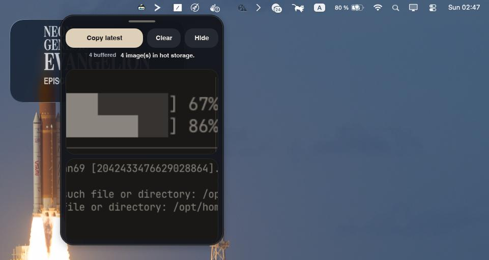

# Pictray

Pictray is a small Rust tray app that keeps a hot history of copied images and dropped text files.

It starts hidden, watches the clipboard for images, stores them locally, and lets you reopen or recopy recent items from a compact Slint window.



## What it does

- Runs as a tray-first app with a hidden-on-start window
- Watches the clipboard and saves copied images automatically
- Deduplicates images and moves repeated items back to the front
- Accepts dropped text and code files such as `.txt`, `.rs`, `.py`, `.c`, `.json`, `.toml`, and other UTF-8 text files
- Copies dropped files into hot storage by default, or moves them there when dropped with `Shift`
- Shows recent images and text files in a small preview gallery
- Copies the latest stored item with `Ctrl+Shift+V`
- Lets you paste from the open window with `Ctrl+V` or `Cmd+V`
- Imports dropped image files, including GIFs

## Run

```bash
cargo run
```

## Build and test

```bash
cargo build
cargo test
cargo fmt --check
```

## How to use

1. Launch Pictray with `cargo run`.
2. Copy an image in another app.
3. Click the tray icon to open the window.
4. Drag text/code files into the window to copy them into hot storage, or hold `Shift` while dropping to move them.
5. Copy a stored image or text file back to the clipboard from the UI, tray menu, or `Ctrl+Shift+V`.

You can also drag image files into the window to import them.

## Storage

Pictray stores files under your platform local data directory in:

- `pictray/originals`
- `pictray/thumbnails`
- `pictray/metadata`

## Stack

- Slint
- tray-icon
- global-hotkey
- arboard
- image
- blake3
